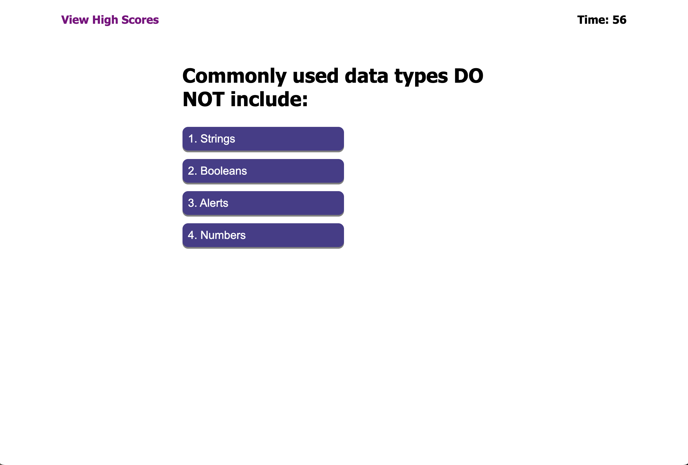
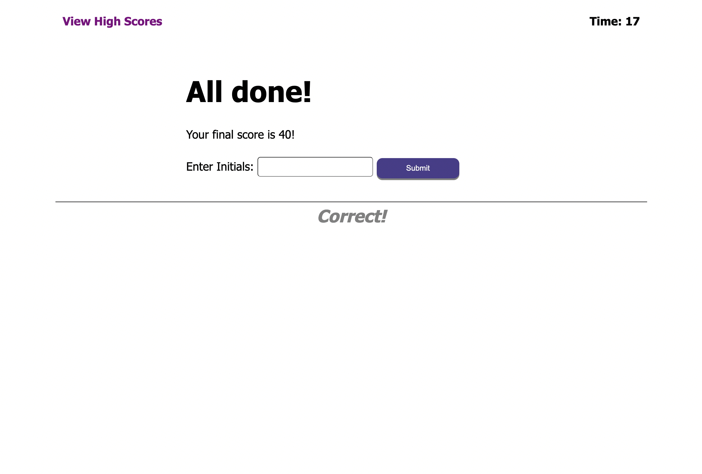

# Code Quiz

## Description

This week’s Challenge invites you to build a timed coding quiz with multiple-choice questions. This app will run in the browser, and will feature dynamically updated HTML and CSS powered by JavaScript code that you write. It will have a clean, polished, and responsive user interface.

## Table of Contents

1. [Deployed Page](#deployed-page)
2. [Acceptance Criteria](#acceptance-criteria)
3. [Comments](#comments)
4. [URL of Deployed Application](#url-of-deployed-application)
5. [Credits](#credits)

## Deployed Page

## Acceptance Criteria

GIVEN I am taking a code quiz
WHEN I click the start button
THEN a timer starts and I am presented with a question
WHEN I answer a question
THEN I am presented with another question
WHEN I answer a question incorrectly
THEN time is subtracted from the clock
WHEN all questions are answered or the timer reaches 0
THEN the game is over
WHEN the game is over
THEN I can save my initials and score

## Comments

1. Created Home Page for mini JavaScript quiz
2. Added a timer in the top right corner
3. Created a button that would take user to page with high scores
4. Included several quiz questions that displayed whether user was correct or wrong
5. Used hover function for user to see which answer they are over
6. Created form that allows user to input their initials to display on score page
7. Added "Go Back" and "Clear High Scores" buttons
8. Made it so time is subtracted from clock when answer is incorrect

## URL of Deployed Application

## Credits

1. Article about hover function by [W3Schools](https://www.w3schools.com/cssref/sel_hover.asp)
2. Articles about buttons and forms by [W3Schools](https://www.w3schools.com/js/js_input_examples.asp)